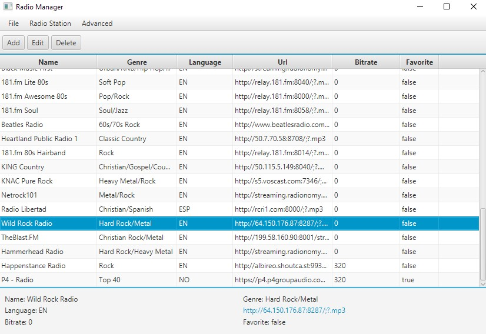
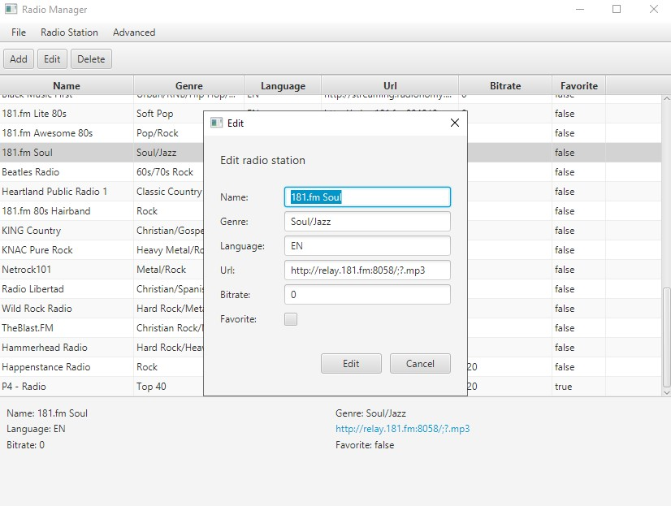

# Radio manager

This is a utility for managing internet radios for trucksim games such as Euro Truck Simulator 2 and American Truck Simulator. It allows for easy editing of files that contains radio livestreams data (live_streams.sii).

## Functionality
At the moment the program is capable of basic functionality such as adding, editing and deleting radio entries. Besides that, it renders overview over all radios and their data.

## Notice before use
- It is recomended to create backup of files before use as program is in early stage of development and can therefore corrupt them.

- There is possibility that the program will fail to load a file. This is because input validation is turned on by default which will block loading if the file is wrongly formatted (something the default file can be). In order to solve this problem, you have to turn input validation off, which is done under "Advanced" tab. (Advanced > Input validation)
- It is adviced only to open one file at the time. This means: open program, open one file, do stuff/save and then close program. Repeat this for next file. Otherwise it probably will merge these two files. 

- Text containing non english character maybe rendered as strange codes i.e "\xc3". This is because game uses different charset/whatever, I don't know. However the game should be capable to convert usual chars to its own ones (if I remember correctly). 

- I don't know what are the requirements for this program to work. One should definitevly have java, but beyond that I don't know. This is also the reason for [migration](#future)

## Download & Installation
- Download for this program is located under "releases" section to the left.

- Program does not require installation, it is ready to use as is.

- Source code is located in intellij/src

## Screenshots

*program's main menu*

*program's example task (editing)*

## Future
At the moment I plan to migrate (re-write) this program to another framework. This is because current (javafx) is outdated and it is troublesom to work with it. After that, I can focus more on functions I would like to add. 

However I have list of features that i want the program to have. 
- Search
- Possibility to listen to radios inside program
- Possibility to add radios directly from services such as "tune in" etc. (however this may be impossible due to terms of service/legal stuff)

